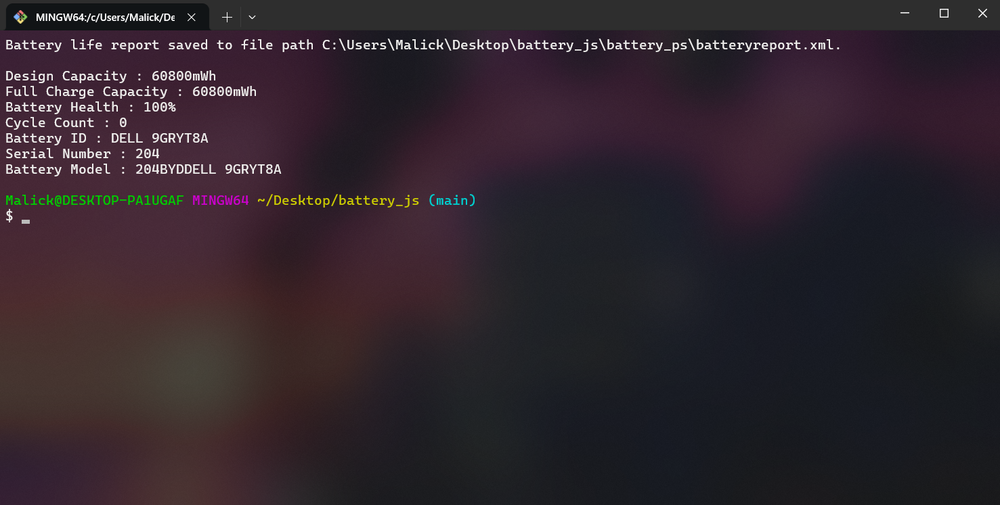

# 🔋Battery_JS

### Get battery details with NodeJS

**📋 Returned data :**

- Design Capacity
- Full Charge Capacity
- Battery Health
- Cycle Count
- Battery ID
- Serial Number
- Battery Model

### 🎬 Some screenshots



## 1 - 📖 How it works

With the help of [Child Process](https://www.npmjs.com/package/childprocess) package
we can execute a powershell script and return data from it , and with using [System Information](https://www.npmjs.com/package/systeminformation) we can get more info about the battery

> importing child process and systeminformation

```js
import { exec } from "child_process";
import { battery } from "systeminformation";
```

> Execute function

```js
const execute = (command, callback) => {
  exec(command, (error, stdout, stderr) => {
    callback(stdout);
  });
};
```

> Exec command line with JS (Exec PS script)

```js
execute(
  "powershell -executionpolicy bypass -File ./battery_ps/get_battery_health.PS1",
  (output) => {
    console.log(output);
    // output (Example)
    // Battery life report saved path
    // Design Capacity : 60800mWh
    // Full Charge Capacity : 60800mWh
    // Battery Health : 100%
    // Cycle Count : 0
    // Battery ID : DELL 9GRYT8A
    // Serial Number : 204
    // Battery Model : 204BYDDELL 9GRYT8A
  }
);
```

## 2 - ▶️ Getting Started

> Clone the repository

```BASH
git clone https://github.com/ADAMSKI-DZ/Battery_JS.git
```

> Install npm packages

```BASH
npm install
```

> Start the app with

```BASH
npm start
```

# Say thank you if this is helpful 🌟🌟

The script style is in early stages (beta)
feel free to contribute

## Contact me 📭

[](https://www.facebook.com/profile.php?id=100092494246970)&emsp;&emsp;
[](https://www.instagram.com/malick_tammal)&emsp;&emsp;
[](https://codepen.io/ADAMSKIDZ)
